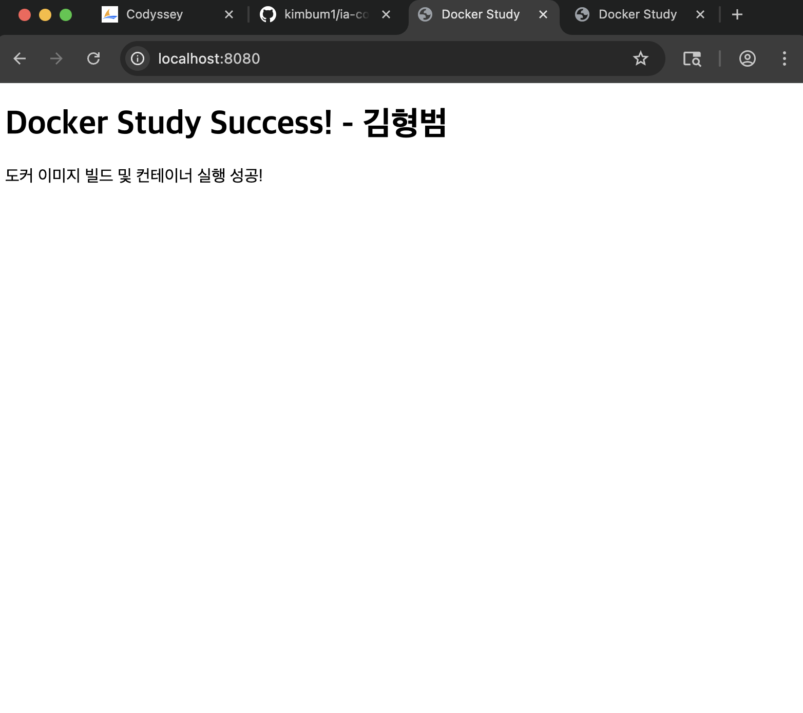

# Docker & Web Server 실습 과제
- **이름**: 김범수 (본인 성함으로 수정하세요)
- **환경**: Mac Apple Silicon (M1/M2/M3)
- **도구**: OrbStack, Docker, Nginx, Redis

## 1. 실습 내용
- Docker를 이용한 Nginx 웹 서버 구동
- 포트 포워딩 (8080 -> 80)
- Docker 볼륨을 이용한 데이터 영속성 확보
- Docker Compose를 활용한 Multi-Container(Web + Redis) 환경 구축

## 2. 결과 증명 (스크린샷)

